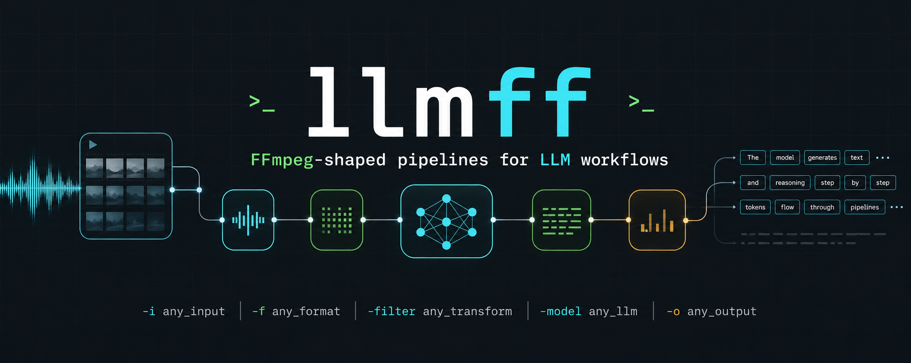

# llmff



`llmff` is an FFmpeg-shaped command-line and library tool for LLM inference pipelines. llmff focuses on a typed pipeline graph, reproducible YAML manifests, backend adapters, local retrieval, JSON validation and repair, and JSONL traces.

## Start Here

- New users: follow [`docs/quickstart.md`](docs/quickstart.md).
- Deciding fit: read [`docs/when-to-use-llmff.md`](docs/when-to-use-llmff.md).
- Example catalog: see [`examples/README.md`](examples/README.md).
- Loop examples: see [`examples/loops/README.md`](examples/loops/README.md).
- Pattern cookbook: see [`docs/cookbook.md`](docs/cookbook.md).
- Agent integrations: see [`docs/agent-workflows.md`](docs/agent-workflows.md).
- Pre-1.0 migration checklist: see
  [`docs/migration/pre-1.0-to-1.0.md`](docs/migration/pre-1.0-to-1.0.md).
- Platform packages and installer assumptions: see
  [`docs/platform-support.md`](docs/platform-support.md).

## Install

Install from GitHub:

```bash
cargo install --git https://github.com/syndicalt/llmff llmff
```

Install the stable `v1.2.0` release with:

```bash
cargo install --git https://github.com/syndicalt/llmff --tag v1.2.0 llmff
```

For a local checkout:

```bash
cargo install --path crates/llmff-cli
```

Verify the installed binary:

```bash
llmff --version
llmff stages list
```

Check local prerequisites without running a pipeline or calling provider
endpoints:

```bash
llmff doctor \
  --run-dir .llmff/run \
  --plugin-dir ./plugins \
  --backend openai=https://api.openai.com/v1 \
  --api-key-env openai=OPENAI_API_KEY
```

Supported release targets and installer assumptions are documented in
[`docs/platform-support.md`](docs/platform-support.md).

Run the install smoke gate from a checkout:

```bash
scripts/smoke-install.sh --path .
```

Smoke test a generated release archive without installing:

```bash
scripts/smoke-archive.sh --archive dist/llmff-1.2.0-x86_64-unknown-linux-gnu.tar.gz
```

Run the release metadata preflight before creating or pushing a release tag:

```bash
scripts/release-preflight.sh v1.2.0
```

After release-tag CI completes, verify a published release's assets, checksums,
and host-compatible packages:

```bash
scripts/check-release-assets.sh v1.2.0
```

Generate and validate Windows MSI packaging metadata:

```bash
scripts/package-windows-msi.sh --binary target/release/llmff.exe --version 1.2.0 --target x86_64-pc-windows-msvc --out-dir dist --emit-wxs-only
```

Build a Windows MSI on a Windows host:

```bash
dotnet tool restore
scripts/package-windows-msi.sh --binary target/release/llmff.exe --version 1.2.0 --target x86_64-pc-windows-msvc --out-dir dist
```

Smoke test a staged Windows MSI payload without installing:

```bash
scripts/smoke-windows-msi.sh --payload-root dist/windows-msi-smoke-root
```

Generate and validate macOS installer payload metadata:

```bash
scripts/package-macos-pkg.sh --binary target/release/llmff --version 1.2.0 --target aarch64-apple-darwin --out-dir dist --emit-payload-only
```

Smoke test a generated macOS installer payload without installing:

```bash
scripts/smoke-macos-pkg.sh --payload-root dist/llmff-1.2.0-aarch64-apple-darwin.pkgroot
```

Smoke test a generated Debian package without root:

```bash
scripts/smoke-deb.sh --deb dist/llmff_1.2.0_amd64.deb
```

Release tags build compressed binary archives, Ubuntu/Debian `.deb` packages, Arch `PKGBUILD` metadata, unsigned Windows MSI packages, and unsigned macOS `.pkg` packages in CI. Trusted Windows Authenticode signing and Apple Developer ID signing/notarization are deferred until paid credentials are available. See [`docs/platform-support.md`](docs/platform-support.md) for the current target matrix.

Tagged release builds publish archives, checksums, `.deb` packages, Arch metadata, Windows MSI packages, and macOS `.pkg` packages as GitHub Release assets. Manual workflow runs keep the same files as Actions artifacts.

## Current Scope

- `llmff run <manifest>` executes a pipeline manifest.
- `llmff inspect <manifest>` dry-run validates graph references, stage requirements, conservative type compatibility, and backend availability.
- `llmff stages list` prints built-in stage names.
- `llmff stages list --format json` prints machine-readable stage metadata and capability flags.
- `llmff backends list` prints built-in and explicitly registered backend families.
- `llmff backends list --format json` prints machine-readable backend family metadata and capability flags, including backends registered with `--backend`, `--ollama`, or `--plugin-dir`.
- `llmff models list --format json` prints runtime model metadata for built-in mock models, CLI-registered OpenAI-compatible or Ollama aliases, and plugin command backends.
- `llmff plugins list --plugin-dir <path>` discovers `llmff-plugin.yaml` manifests and prints plugin capability metadata.
- `llmff run --plugin-dir <path>` can execute plugin-provided stages, backends, and tool transports declared in those manifests.
- `llmff doctor` checks local prerequisites such as binary version, run-dir writability, plugin manifest validity, API-key environment wiring, and optional release trust manifest presence without making network calls.
- The core crate owns execution semantics; the CLI is a thin adapter.
- Mock backends are available for deterministic local runs and tests.
- An OpenAI-compatible backend exists in the core crate for `/v1/chat/completions` servers.

This is not a native inference kernel, model conversion tool, serving platform, or agent framework.

## Example

Run the JSON repair example with deterministic mock model responses:

```bash
LLMFF_MOCK_BAD_RESPONSE='{"wrong":true}' \
LLMFF_MOCK_GOOD_RESPONSE='{"answer":"ok"}' \
llmff run examples/json-repair.yaml --trace /tmp/llmff-trace.jsonl
```

Run independent ready stages concurrently:

```bash
LLMFF_MOCK_GOOD_RESPONSE='{"answer":"ok"}' \
llmff run --parallel pipeline.yaml
```

Stream run and stage lifecycle events as JSONL:

```bash
LLMFF_MOCK_GOOD_RESPONSE='{"answer":"ok"}' \
llmff run --events - pipeline.yaml
```

Run a compact inline graph:

```bash
LLMFF_MOCK_GOOD_RESPONSE='{"answer":"ok"}' \
llmff run -i examples/question.txt \
  -g 'load | infer(model=mock:good) | write(-)'
```

Run inline retrieval over local documents:

```bash
llmff run -i examples/question.txt \
  -g 'load | retrieve(documents=examples/retrieval/python.txt;examples/retrieval/rust.txt,top_k=1) | write(matches.json)'
```

Use deterministic local embedding-style retrieval when lexical token overlap is
too strict:

```bash
llmff run -i examples/question.txt \
  -g 'load | retrieve(documents=examples/retrieval/python.txt;examples/retrieval/rust.txt,top_k=1,strategy=embedding) | write(matches.json)'
```

Rerank retrieved matches without calling a remote service:

```bash
llmff run -i examples/question.txt \
  -g 'load | retrieve(documents=examples/retrieval/python.txt;examples/retrieval/rust.txt,top_k=2) | rerank(strategy=embedding,top_k=1) | write(matches.json)'
```

Cache an inline pipeline value across runs:

```bash
llmff run -i examples/question.txt \
  -g 'load | cache(path=.llmff/cache,key=prompt-v1) | write(cached-question.txt)'
```

Name inline stages and reference them explicitly:

```bash
LLMFF_MOCK_GOOD_RESPONSE='ok' \
llmff run -i examples/question.txt \
  -g 'load#prompt | template#render(examples/prompt.tmpl) | infer#draft(from=render,model=mock:good) | write#save(from=draft,path=answer.txt)'
```

Inline `load` reads stdin when `-i/--input` is omitted:

```bash
cat examples/question.txt | LLMFF_MOCK_GOOD_RESPONSE='{"answer":"ok"}' \
  llmff run -g 'load | infer(model=mock:good) | write(-)'
```

Inspect the manifest without running model calls:

```bash
llmff inspect examples/json-repair.yaml
```

Emit a machine-readable reproducibility report for agents and CI:

```bash
llmff inspect examples/json-repair.yaml --format json
```

The JSON report includes schema compatibility versions, the manifest hash,
resolved inputs and outputs, stage order, backend registrations, plugin
protocol metadata, plugin manifests, execution controls, and stdout ownership.

Inspect an inline graph without running model calls:

```bash
llmff inspect -g 'load | infer(model=mock:good) | write(-)'
```

`inspect` catches type mismatches that are statically provable, such as field-based route stages whose source is known to be text rather than JSON.

Inspect a manifest that references a registered backend alias:

```bash
llmff inspect pipeline.yaml \
  --backend openai=https://api.openai.com/v1 \
  --api-key-env openai=OPENAI_API_KEY
```

Inspect a manifest that references plugin stages:

```bash
llmff inspect pipeline.yaml --plugin-dir ./plugins
```

List built-in stages:

```bash
llmff stages list
```

List stage capability metadata:

```bash
llmff stages list --format json
```

List backend capability metadata:

```bash
llmff backends list --format json
```

Include runtime-registered providers in backend metadata:

```bash
llmff backends list --format json \
  --backend openai_alt=https://api.example.test/v1 \
  --ollama local=http://localhost:11434 \
  --plugin-dir ./plugins
```

List runtime model metadata separately from backend family metadata:

```bash
llmff models list --format json \
  --backend openai_alt=https://api.example.test/v1 \
  --ollama local=http://localhost:11434 \
  --plugin-dir ./plugins
```

List plugin manifest metadata:

```bash
llmff plugins list --plugin-dir ./plugins --format json
```

Run a manifest that uses plugin capabilities:

```bash
llmff run pipeline.yaml --plugin-dir ./plugins
```

Plugin stage capabilities run as stdin/stdout command stages with `op: plugin:<capability-name>`. Plugin tool transports run through `op: tool` with `transport: <capability-name>`. Plugin backend capabilities register their capability name as a model alias, so a backend named `local-echo` serves manifest model ids such as `local-echo:test-model`. Backend commands receive the serialized inference request on stdin and return JSON on stdout:

```json
{"text":"model output","usage":{"prompt_tokens":12,"completion_tokens":8,"total_tokens":20}}
```

Plugin sampler capabilities can be attached to `infer` and `repair` stages with `sampler: <capability-name>`. Sampler commands receive the serialized inference request on stdin and return JSON sampling overrides on stdout:

```json
{"temperature":0.1,"top_p":0.9,"max_tokens":256,"seed":12345,"response_format":"json","stop":["DONE"]}
```

Only returned fields are applied; omitted fields keep the stage or backend defaults.

Use stdin/stdout by setting manifest input or output paths to `-`.

Inline graphs support `op`, `op(value)`, and `op(key=value)` stage syntax for `run` and `inspect`. A stage can be named as `op#id`, and later stages can use `from=id` to reference it instead of the previous stage. Use semicolons inside the `documents` value for inline `retrieve`, such as `documents=docs/a.txt;docs/b.txt`. Inline `retrieve` and `rerank` accept `strategy=lexical` or `strategy=embedding`. Inline `tool` supports `command`, `method`, `url`, and `header:<name>` parameters. Manifests remain the canonical format for complex branching graphs and version-controlled recipes.

Call a command tool from an inline graph:

```bash
llmff run -i examples/question.txt \
  -g 'load | tool(command=/bin/cat) | write(tool-output.txt)'
```

Call an HTTP tool from an inline graph:

```bash
llmff run -i examples/question.txt \
  -g 'load | tool(method=POST,url=http://127.0.0.1:8080/process,header:content-type=text/plain) | write(tool-output.txt)'
```

For development without installing, prefix commands with `cargo run -p llmff --`, for example:

```bash
cargo run -p llmff -- inspect examples/json-repair.yaml
```

Manifest stages may be written in any order. `llmff` validates references across the full graph and executes stages in dependency order. By default stages execute sequentially for deterministic local behavior; `run --parallel` executes independent ready stages concurrently.

`run --events <path>` writes the same JSONL lifecycle events as `--trace` while
the pipeline is running. Use `run --events -` to stream those events to stdout
for supervisors, dashboards, or shell pipelines. Keep pipeline outputs pointed
at files when streaming events to stdout to avoid interleaving two data streams.

Manifest stages can reference file-backed resources relative to the manifest:

```yaml
graph:
  - id: render_prompt
    op: template
    from: load_prompt
    path: ./prompt.tmpl

  - id: apply_policy
    op: system
    from: render_prompt
    path: ./policy.md

  - id: validate
    op: validate_json
    from: draft
    schema_path: ./answer.schema.json
```

Inputs default to text. Set `format: json` to parse an input into a structured JSON value:

```yaml
inputs:
  payload:
    path: ./payload.json
    format: json
```

JSON inputs can be templated by object field and used by field-based routes. Invalid JSON fails the load stage with a stage execution error.

`template` replaces `{{input}}` when the parent value is text. When the parent value is a JSON object, object fields are available by name, such as `{{name}}`.

`system` with a `path` preserves chat roles for model calls: the file contents become a `system` message and the parent value becomes a `user` message. Text-only stages render messages conservatively as `role: content` lines when they need a string.

Retrieve stages select local UTF-8 documents with deterministic lexical scoring:

```yaml
graph:
  - id: retrieve_context
    op: retrieve
    from: load_prompt
    documents:
      - examples/retrieval/python.txt
      - examples/retrieval/rust.txt
    top_k: 1
```

`retrieve` renders its parent value as query text and returns JSON with `query`, `strategy`, and `matches`. The default `strategy: lexical` tokenizes the query and each document, scores documents by matching unique query terms, then sorts by score and path. `strategy: embedding` uses deterministic local character n-gram vectors and cosine similarity so near-overlap text can rank even when whole tokens differ. Embedding retrieval can persist those local vectors with `index: .llmff/retrieve/context.index.json`; matching document metadata is reused on later runs, changed documents are re-indexed, and the output includes `index.path`, `index.reused_documents`, and `index.indexed_documents`. `strategy: command` runs a stdin/stdout command provider for remote embedding services or external vector indexes. The command receives JSON with `query`, `documents`, and optional `top_k`, and returns retrieve-shaped JSON. Document paths are relative to the manifest unless absolute. `top_k` is optional and must be greater than zero when present.

`rerank` accepts retrieve-shaped JSON with `query` and `matches`, rescoring each match's `text` with `strategy: lexical` or `strategy: embedding`. `strategy: command` runs a stdin/stdout command provider for learned reranker models. The command receives the retrieve-shaped JSON plus optional `top_k`, and returns retrieve-shaped JSON. Local reranking preserves match fields, replaces `score`, writes the selected `strategy`, and applies optional `top_k` after sorting.

Cache stages persist and reuse successful parent values across runs:

```yaml
graph:
  - id: cached_prompt
    op: cache
    from: render_prompt
    path: .llmff/cache
    key: prompt-v1
```

`cache` stores typed values as versioned JSON records under `path`, defaulting to `.llmff/cache`. With an explicit `key`, the manifest author controls the cache identity; without one, the parent value is part of the digest. Cache stages do not require environment variables and only cache successful parent values.

Route stages choose between already-computed stage outputs:

```yaml
graph:
  - id: choose_final
    op: route
    from: validate
    on_success: validate
    on_invalid: repair
```

For JSON object outputs, route can select by scalar field value:

```yaml
graph:
  - id: choose_model_output
    op: route
    from: classify
    field: kind
    cases:
      simple: fast_answer
      hard: strong_answer
    default: fast_answer
```

Stages can be guarded with `when` so they only run when their parent stage has a matching status:

```yaml
graph:
  - id: repair
    op: repair
    from: validate
    when: invalid
    model: mock:good
```

Supported conditions are `success`, `invalid`, and `skipped`. A non-matching condition marks the guarded stage as skipped before any stage-specific work runs, so model calls, tool calls, and writes are not invoked for skipped stages. Skipped stages still appear in traces with `status=skipped`.

Tool stages call explicitly declared commands or HTTP endpoints:

```yaml
graph:
  - id: normalize
    op: tool
    from: render_prompt
    command: ["/bin/cat"]
```

Command tools use argv directly, never a shell string. The serialized parent value is written to stdin and stdout becomes the stage output.

```yaml
graph:
  - id: call_endpoint
    op: tool
    from: render_prompt
    method: POST
    url: http://127.0.0.1:8080/process
    headers:
      content-type: text/plain
```

HTTP tools require `method` and `url`. `POST`, `PUT`, and `PATCH` send the serialized parent value as the request body; response text becomes the stage output.

Write stages persist a successful parent value from inside the graph and forward the same value:

```yaml
graph:
  - id: save_answer
    op: write
    from: validate
    path: ./answer.json
```

Top-level `outputs` remain supported for simple final outputs. Use `write` when the pipeline itself should express the write step, or when an intermediate value should be saved.

## Trace Notes

`--trace <path>` writes JSONL events for run and stage lifecycle events. Trace events include `timestamp_ms`; `stage_finished` events also include `duration_ms`.

Stage traces add safe operation metadata when available:

- `model`, `backend`, and `provider_model` for model-calling stages.
- `prompt_tokens`, `completion_tokens`, and `total_tokens` for model-calling stages when the backend reports usage.
- `validation_errors` for invalid validation results.
- `tool_kind` and `tool_target` for tool stages.
- `output_path` for write stages.
- `cache_hit` and `cache_path` for cache stages.

Trace metadata intentionally avoids full prompt bodies, cached values, tool stdin/stdout, headers, and secrets.

Summarize a trace file:

```bash
llmff trace /tmp/llmff-trace.jsonl
```

The trace summary prints run status, stage status, duration, and safe metadata only. Total usage is summarized as `usage=<total>`.

## Backend Notes

The CLI keeps backend registration explicit. This keeps commands portable and FFmpeg-like: the command line describes the run, while environment variables are only used when you choose to read a secret by name.

`run` and `inspect` accept the same backend registration flags. `inspect` validates that model ids resolve to configured backends, but it does not call model servers, tools, or pipeline stages.

Register an OpenAI-compatible backend:

```bash
llmff run pipeline.yaml \
  --backend openai=https://api.openai.com/v1 \
  --api-key-env openai=OPENAI_API_KEY
```

OpenAI-compatible backend URLs may point either at the server root or at the API root. Both `https://api.openai.com` and `https://api.openai.com/v1` resolve to the `/v1/chat/completions` endpoint.

Then reference that backend alias from a manifest:

```yaml
graph:
  - id: draft
    op: infer
    from: load_prompt
    model: openai:gpt-4.1-mini
```

The model id before the first colon is the backend alias. The model id after the first colon is sent to the provider.

For local OpenAI-compatible servers that do not require auth, omit the key flag:

```bash
llmff run pipeline.yaml \
  --backend local=http://localhost:8000/v1
```

Register a native Ollama backend:

```bash
llmff run pipeline.yaml \
  --ollama ollama=http://localhost:11434
```

Then reference the alias from a manifest or inline graph:

```yaml
graph:
  - id: draft
    op: infer
    from: load_prompt
    model: ollama:llama3.1
```

Model-calling stages accept portable sampling controls:

```yaml
graph:
  - id: draft
    op: infer
    from: load_prompt
    model: openai:gpt-test
    temperature: 0.2
    top_p: 0.9
    max_tokens: 256
    seed: 12345
    response_format: json
    stop:
      - "\nEND"
      - "</answer>"
```

OpenAI-compatible backends receive `temperature`, `top_p`, `max_tokens`, `seed`, `response_format`, and `stop`. They also expose a streaming contract for server-sent chat completion deltas. Use `llmff run --stream-stage <stage-id>` to stream one stage to stdout while still writing the normal manifest outputs. For `infer` stages, `llmff` streams backend token deltas as they arrive; for deterministic and integration stages, it streams the serialized stage payload when the stage finishes. Do not combine `--stream-stage` with `--events -` or manifest outputs that write to `-`; write lifecycle events and final outputs to files to keep the stream clean. Ollama receives the same controls under `options` except `response_format: json`, which maps to the top-level Ollama `format: "json"` hint. Inline graphs accept `seed=12345`, `response_format=json`, and stop sequences with semicolon separators, such as `stop=END;DONE`.

Mock backends remain available for deterministic local runs and tests:

- `LLMFF_MOCK_BAD_RESPONSE`
- `LLMFF_MOCK_GOOD_RESPONSE`

Those mock env vars are convenience fixtures, not the primary backend configuration model.

`llmff models list` reports the runtime model aliases that the current command
line makes available. JSON output includes the model alias, backend name,
backend kind, runtime class, source, registration flag, API key requirement,
and portable capability flags.

## Limitations

- Schema values are inline JSON strings in the current manifest format.
- `llmff run --stream-stage <stage-id>` streams one selected stage to stdout. `infer` stages stream token deltas when the backend supports them; other stages stream their serialized payload after the stage finishes.
- Plugin manifests can be discovered and listed, and plugin stages, backend commands, tool transports, and samplers can run through stdin/stdout plugin entrypoints.
- Multimodal values are not implemented yet.
- Native model loading, quantization, and hardware scheduling are out of scope for this MVP.
